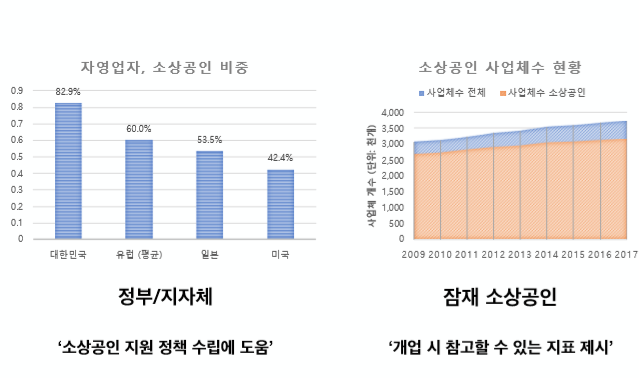
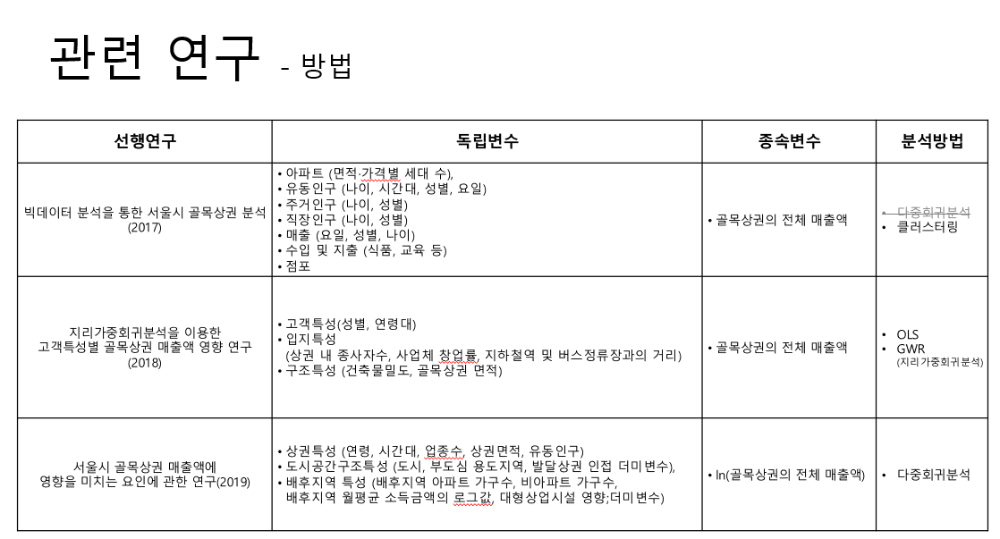
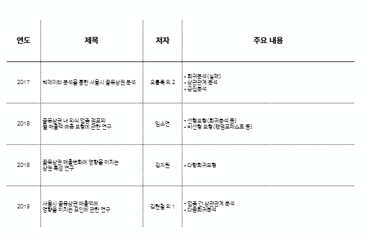
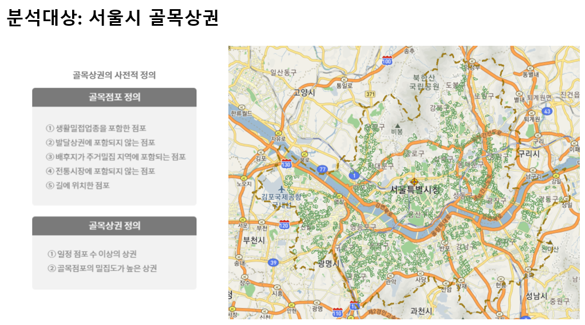
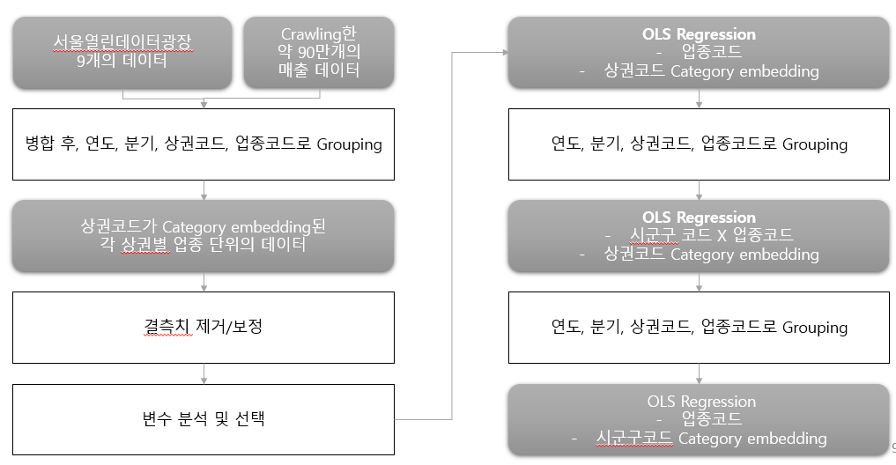
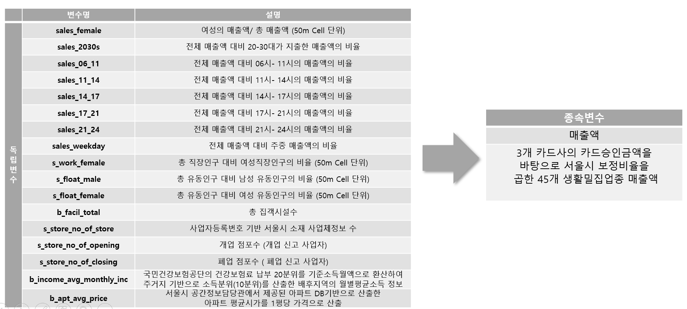
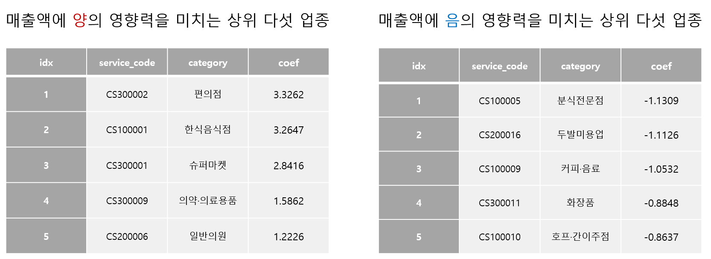
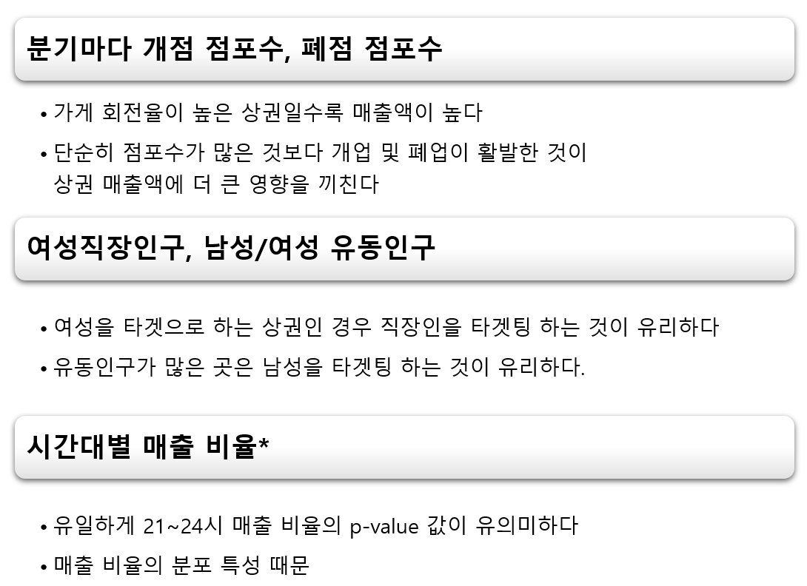
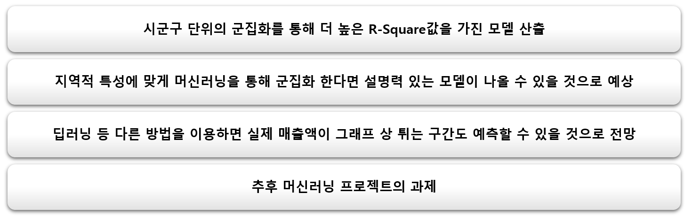

# Regression_project
서울시 상권별 월매출 예측하기

 

### 1. 연구배경

  
### 2. 선행연구

> 서울시 골목상권 분석 관련연구

 
> > 카테고리변수 차원 축소 + 회귀분석 관련 연구

 

 

## 3. [1차 연구] 회귀분석을 이용한 예측

####  3-1. 문제정의

> 선행 연구 논문의 한계점을 극복하여 더 나은 R-Square 값이 나오는 모델 제안

- 지리적 특성을 나타내는 변수, 업종을 나타내는 변수 추가
- 2015~2019년 데이터 셋을 활용하여 기존 연구 논문보다 더 많은 데이터 확보

#### 3-2. 분석대상

#### 3-3. 전처리 방법 및 분석 과정

#### 3-4. 변수 설명

#### 3-5. 분석결과

- 분석 1 - 수치형 데이터 변수만으로 OLS 회귀분석
  - R-Squared: 0.296
  - 업종코드 범주형 데이터 추가 시  •R-Squared=0.29
  - 다중공선성 발생
- 분석 2 -  행정구 코드로 카테고리 변수 변경한 후 OLS 회귀분석
  - •R-Squared: 0.420
- 과최적화 여부 확인 
  - K-fold 결과 과최적화가 일어나지 않았다고 판단

#### 3-6. 소결론

- 
- 
- 

  
## 4. [2차연구] 머신러닝을 이용한 예측

#### 4. 분석내용

### 5. 앞으로 보완할 점

